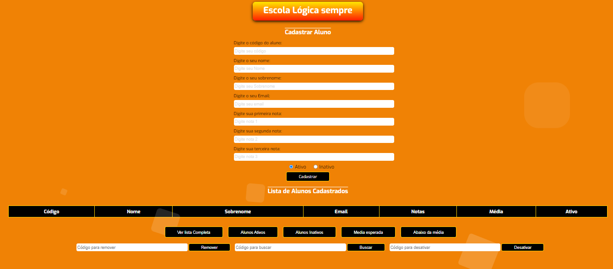

<h1 align="center"> CRUD Básico em JavaScript </h1>

Pequeno sistema de escola desenvolvido como projeto final do módulo de lógica de programação da AdaTech 

 

  

## 🚀 Tecnologias

Esse projeto foi desenvolvido com as seguintes tecnologias:

- HTML e CSS
- JavaScript
- Git e Github

## 💻 Projeto

O CRUD foi desenvolvido por mim, no final do módulo de Lógica de programação. Desenvolvido para melhorar minhas habilidades e compreensões a respeito do JavaScript.

## Créditos

Feito por:
 Dário Klein
